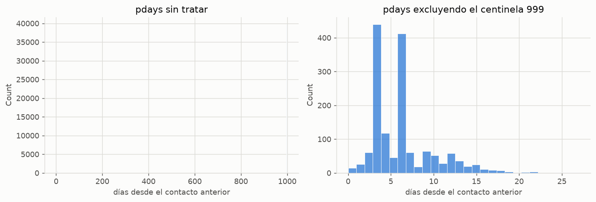
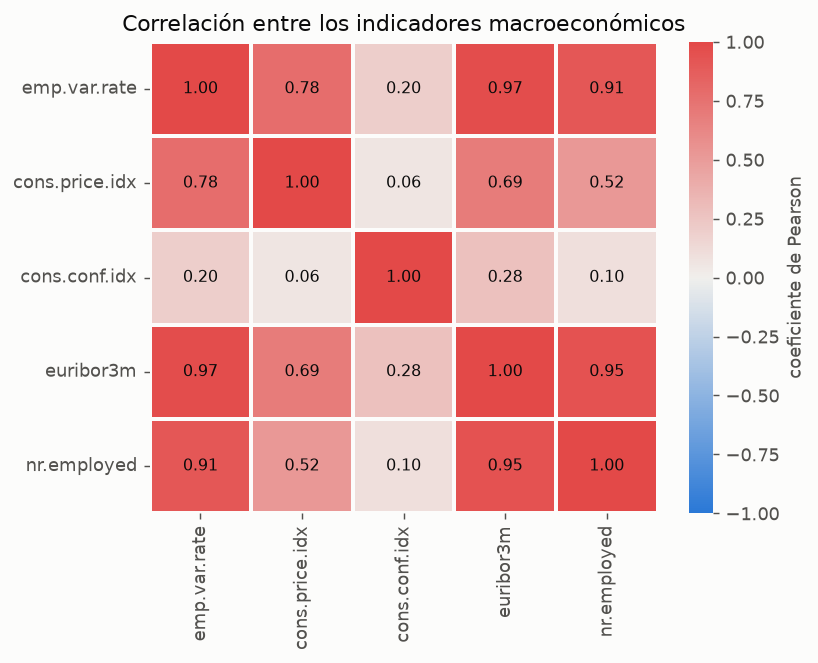
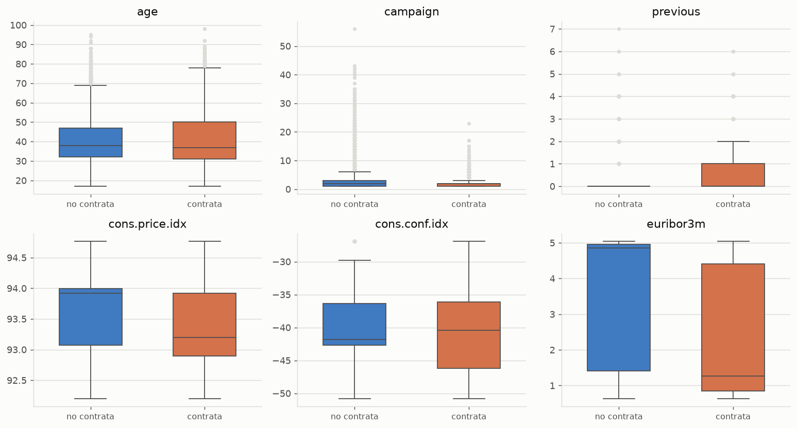
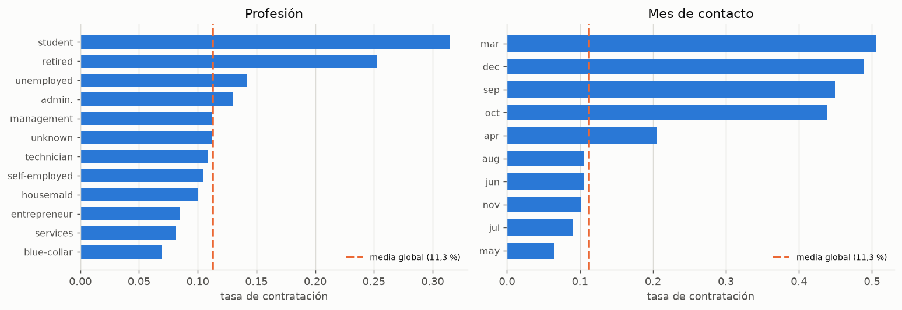
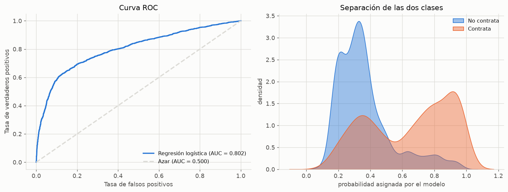
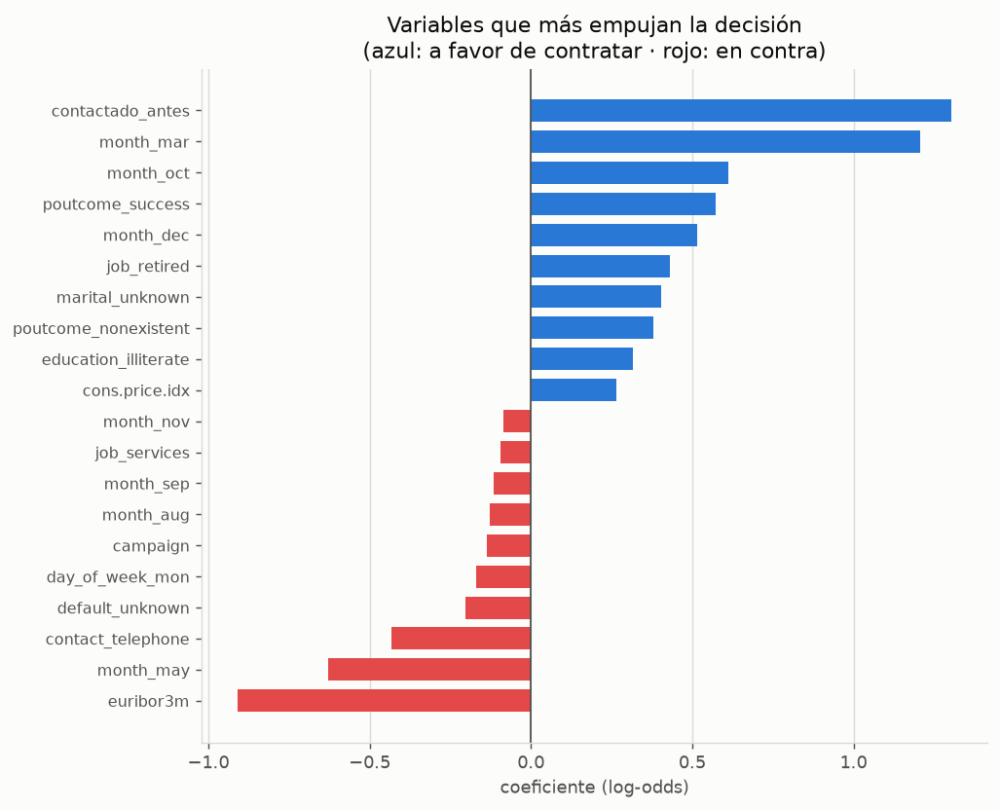
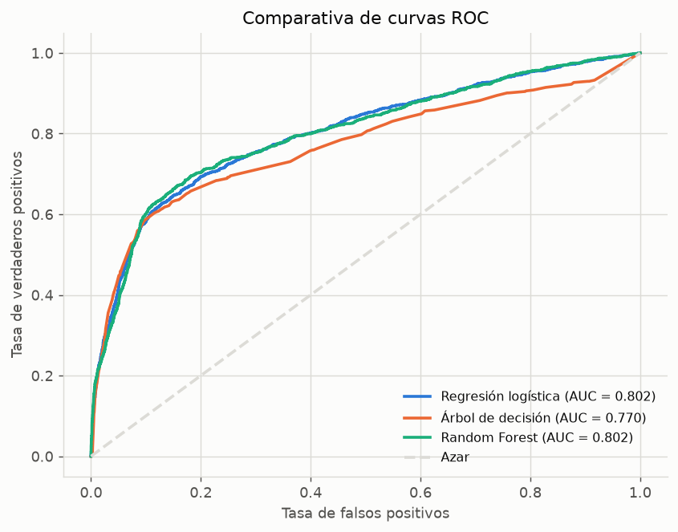
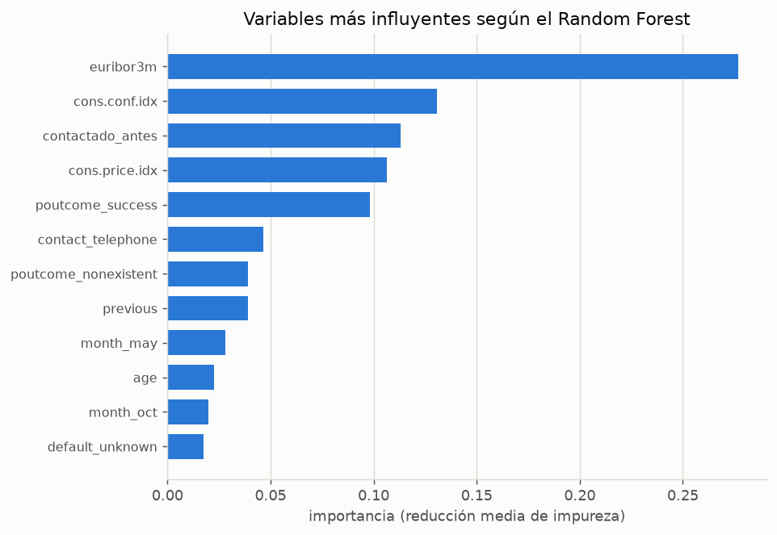
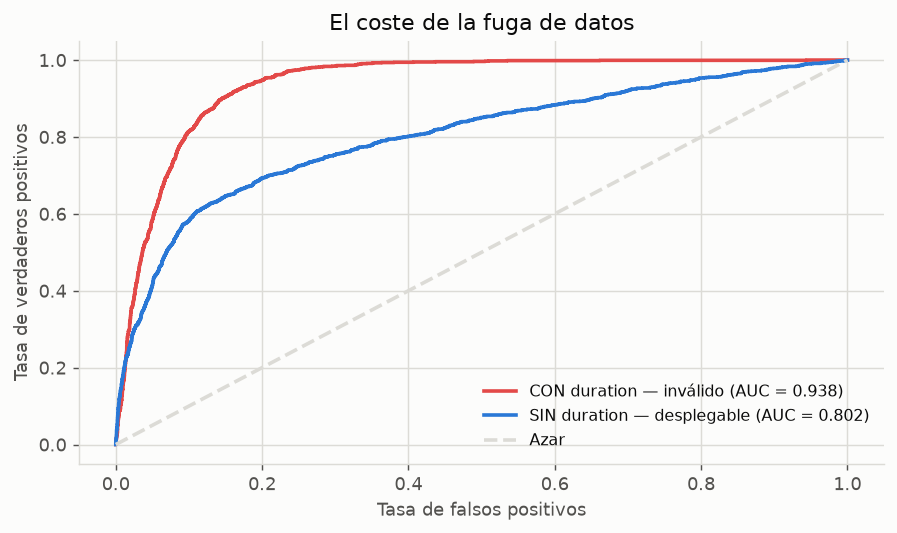
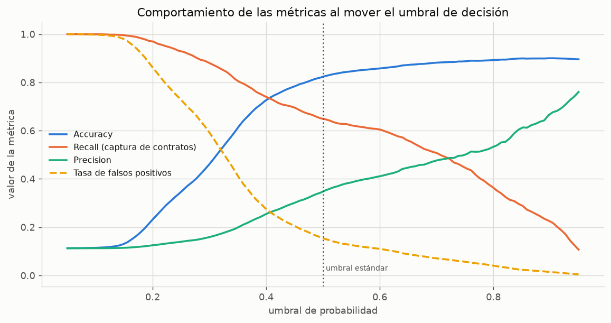

# Predicción de suscripción a depósitos a plazo en campañas de telemarketing bancario

Un modelo de clasificación binaria sobre 41.188 llamadas comerciales de un banco portugués,
con especial atención a tres patologías del conjunto de datos que la inspección rutinaria no
revela: valores ausentes codificados como texto, un valor centinela que contamina el escalado,
y una variable con fuga de información que infla el rendimiento en 13 puntos de AUC.

---

## 1. Planteamiento

Entre mayo de 2008 y noviembre de 2010, una entidad bancaria portuguesa realizó campañas de
telemarketing para colocar depósitos a plazo fijo. Cada registro del conjunto de datos
corresponde a una llamada; la variable objetivo indica si el cliente terminó contratando el
producto.

El problema tiene una formulación operativa directa: **¿a qué clientes conviene llamar?** Cada
llamada consume tiempo de operador, de modo que un modelo capaz de ordenar la cartera por
probabilidad de contratación se traduce en un aumento directo de la productividad del centro de
llamadas.

| | |
|---|---|
| **Registros** | 41.188 |
| **Variables predictoras** | 20 (10 numéricas, 10 categóricas) |
| **Variable objetivo** | `y` — contratación del depósito (sí/no) |
| **Prevalencia de la clase positiva** | 11,27 % |
| **Origen** | [UCI Machine Learning Repository](https://archive.ics.uci.edu/dataset/222/bank+marketing) — Moro, Cortez y Rita (2014) |

El conjunto incorpora cinco indicadores macroeconómicos nacionales (tipo euríbor, índice de
precios al consumo, confianza del consumidor, variación del empleo y número de ocupados)
publicados por el Banco de Portugal. Esta particularidad resulta determinante: el período
cubierto coincide con la crisis financiera, y los autores originales demostraron que el
contexto económico predice la contratación con mayor fuerza que el propio perfil del cliente.
El análisis que sigue confirma ese hallazgo.

---

## 2. Consideración metodológica previa: la métrica

Con una prevalencia del 11,27 %, un clasificador que predijese sistemáticamente la clase
mayoritaria alcanzaría una exactitud del **88,73 %** sin extraer información alguna de los
datos. La exactitud queda por tanto descartada como criterio de evaluación.

El análisis se apoya en el **AUC** —que mide la capacidad de ordenar clientes por probabilidad,
con independencia del umbral escogido— y en el **recall de la clase positiva**, que cuantifica
qué fracción de los clientes potencialmente interesados llega a identificarse. La exactitud se
reporta únicamente a título informativo.

---

## 3. Diagnóstico del conjunto de datos

### 3.1. Valores ausentes codificados como texto

La inspección mediante `df.info()` declara 41.188 valores no nulos en las 21 columnas, esto es,
ausencia total de datos faltantes. La afirmación es falsa. La documentación original advierte
de que los valores ausentes se codificaron con la etiqueta `unknown`, indistinguible para
pandas de cualquier otra categoría legítima:

| Columna | Registros `unknown` | Proporción |
|---|---:|---:|
| `default` | 8.597 | 20,9 % |
| `education` | 1.731 | 4,2 % |
| `housing` | 990 | 2,4 % |
| `loan` | 990 | 2,4 % |
| `job` | 330 | 0,8 % |
| `marital` | 80 | 0,2 % |

**Decisión adoptada: conservar `unknown` como categoría.** La imputación por moda exigiría
fabricar el 21 % de los valores de `default`, y existe además una razón sustantiva para
preservarlos: la negativa a declarar una circunstancia personal puede ser informativa por sí
misma. Al tratarse de variables categóricas, la codificación *one-hot* asigna a `unknown` una
columna propia y delega en el modelo la estimación de su efecto.

### 3.2. El valor centinela de `pdays`

La variable `pdays` registra los días transcurridos desde el último contacto en una campaña
anterior. El **96,32 %** de los registros toma el valor 999, que no denota una cantidad sino la
condición «cliente nunca contactado con anterioridad».



El panel izquierdo resulta ininteligible. Una vez excluido el centinela (panel derecho), la
variable revela su rango efectivo —de 0 a 27 días— y una estructura que no es estadística sino
organizativa: los picos en 3 y 6 días reproducen el protocolo de rellamada del centro de
atención, y los valles intermedios corresponden a las jornadas en que no se efectuaban
contactos de seguimiento.

Las consecuencias de ignorar esta particularidad son graves. La media de la columna sin tratar
asciende a 962, un valor que no describe a ningún cliente real. Tras la estandarización, los
39.673 clientes sin historial se concentran en torno a *z* ≈ 0,2 mientras que los 1.515
restantes se desplazan a *z* ≈ −5, donde cualquier modelo los interpretará como observaciones
atípicas; la variación interna de estos últimos —precisamente la informativa— queda comprimida
hasta desaparecer.

El contraste entre ambos grupos justifica la preocupación:

| Historial de contacto | Tasa de contratación | n |
|---|---:|---:|
| Contactado en campaña anterior | **63,8 %** | 1.515 |
| Sin contacto previo | 9,3 % | 39.673 |

Una diferencia de casi siete veces. La columna se sustituye por el indicador binario
`contactado_antes`, que captura la práctica totalidad de la señal.

### 3.3. Multicolinealidad entre los indicadores macroeconómicos



Tres de los cinco indicadores presentan correlaciones entre 0,91 y 0,97: `emp.var.rate`,
`euribor3m` y `nr.employed` miden esencialmente el mismo fenómeno subyacente, el ciclo económico.

La multicolinealidad no degrada la capacidad predictiva, pero invalida la interpretación de los
coeficientes. Un coeficiente de regresión logística se define como el efecto de incrementar una
variable *manteniendo las demás constantes*; cuando dos regresores se mueven al unísono, esa
condición describe una situación inexistente en los datos, y el reparto del efecto conjunto
entre ambos resulta arbitrario e inestable. Dado que la interpretabilidad constituye la
principal ventaja del modelo lineal frente a los métodos de conjunto, la pérdida no es menor.

Se conservan `euribor3m` como representante del bloque y los dos indicadores no redundantes
(`cons.price.idx` y `cons.conf.idx`, con correlaciones de 0,06 a 0,28 respecto al resto).

### 3.4. Fuga de información: la variable `duration`

La variable `duration` recoge la duración de la llamada en segundos. La documentación original
es explícita al respecto:

> *«the duration is not known before a call is performed. Also, after the end of the call y is
> obviously known. Thus, this input should only be included for benchmark purposes and should be
> discarded if the intention is to have a realistic predictive model.»*

Se trata de un caso de manual de fuga de información: el dato solo existe una vez concluida la
llamada, momento en el que la variable objetivo ya se conoce. Un modelo que la incorpore no es
desplegable, puesto que el día en que deba decidirse a quién llamar ese valor no estará
disponible. La sección 7 cuantifica el sesgo que introduce.

### 3.5. Valores atípicos



Los diagramas de caja muestran observaciones extremas en `age` (clientes de hasta 98 años) y
`campaign` (hasta 56 contactos en la misma campaña). **No se aplica recorte alguno.** Ninguno de
estos valores constituye un error de registro: personas de edad avanzada existen —y de hecho el
segmento de jubilados presenta una de las tasas de contratación más altas del conjunto—, y una
secuencia de 56 llamadas describe un caso real, por infrecuente que resulte.

El criterio aplicado es que un valor atípico se corrige cuando responde a un fallo de captura,
no cuando describe un caso infrecuente pero verídico. Aplicar una winsorización automática por
rango intercuartílico habría destruido precisamente los segmentos de mayor rendimiento.

---

## 4. Tratamiento de las variables categóricas



Ambas variables presentan una dispersión notable en torno a la media global del 11,3 %. Los
estudiantes (31,4 %) y los jubilados (25,2 %) cuadruplican la tasa de los obreros manuales
(6,9 %); en la dimensión temporal, marzo (50,5 %), diciembre (48,9 %) y septiembre (44,9 %)
multiplican por ocho el rendimiento de mayo (6,4 %), que concentra sin embargo el mayor volumen
de llamadas.

**Decisión adoptada: no agrupar las categorías minoritarias.** La codificación completa produce 43
variables indicadoras —50 predictores en total—, un número perfectamente manejable, y las categorías poco frecuentes
son justamente las más informativas. Agrupar «estudiante» y «jubilado» en una categoría residual
habría eliminado la señal más nítida del bloque sociodemográfico. El criterio habitual de
agrupar por debajo del 5 % de frecuencia responde a un problema distinto —categorías con
efectivos tan reducidos que su tasa es puro ruido—, que aquí no se presenta: la categoría
`student` reúne 875 observaciones.

---

## 5. Procedimiento

```
Codificación one-hot  →  partición estratificada  →  estandarización
```

El orden es deliberado. La estandarización se ajusta **exclusivamente sobre el conjunto de
entrenamiento** (`fit_transform`) y se aplica al de prueba mediante `transform`. Estandarizar
antes de particionar —una secuencia frecuente en material didáctico— calcularía la media y la
desviación típica empleando también las observaciones de prueba, que dejarían así de constituir
datos no vistos.

La partición es estratificada (70 / 30) para preservar la prevalencia del 11,27 % en ambos
subconjuntos; sin esta precaución, la variabilidad muestral puede alterar la proporción de
positivos y comprometer la comparabilidad de las métricas.

Todos los modelos se ajustan con `class_weight='balanced'`, que pondera los errores de forma
inversamente proporcional a la frecuencia de cada clase. El efecto es determinante:

| Configuración | Exactitud | Recall (clase positiva) |
|---|---:|---:|
| Sin ponderación | 0,902 | 0,225 |
| Con `class_weight='balanced'` | 0,823 | **0,649** |

Un descenso de ocho puntos de exactitud a cambio de casi triplicar la detección de clientes
interesados. Dado que el objetivo operativo consiste en identificar candidatos, el intercambio
es claramente favorable.

---

## 6. Resultados

### 6.1. Modelo de referencia

La regresión logística alcanza un **AUC de 0,802** con un recall del 64,9 % sobre la clase
positiva.



La representación de densidades resulta más informativa que la curva ROC: las distribuciones de
probabilidad asignada a cada clase se solapan de forma considerable, pero sus modas están
netamente desplazadas. El modelo no separa a los dos grupos de manera limpia —difícilmente
podría hacerlo con la información disponible antes de la llamada—, aunque sí los ordena con
solvencia, que es lo que el problema requiere.

### 6.2. Interpretación de los coeficientes



Eliminada la multicolinealidad, los coeficientes admiten lectura directa. Los resultados son
coherentes con el marco económico del período:

- **`contactado_antes`** encabeza los efectos positivos, confirmando el diagnóstico de la
  sección 3.2.
- **`euribor3m`** presenta el coeficiente negativo de mayor magnitud. Con tipos de interés
  elevados la contratación cae, lo que a primera vista contradice la intuición —un depósito
  rinde más cuando los tipos suben—. La interpretación correcta apunta al ciclo: el euríbor
  alto corresponde a la fase previa a la crisis, mientras que su desplome acompaña al período de
  máxima aversión al riesgo, cuando el depósito a plazo se convierte en refugio.
- **La estacionalidad domina sobre el perfil del cliente**: los indicadores de marzo, octubre y
  diciembre superan en peso a cualquier variable sociodemográfica.
- **`contact_telephone`** aparece con signo negativo frente al teléfono móvil, un efecto de
  canal bien documentado en la literatura sobre telemarketing.

### 6.3. Comparativa de modelos

| Modelo | AUC | Exactitud | Precisión | Recall | F1 |
|---|---:|---:|---:|---:|---:|
| **Random Forest** | **0,8021** | 0,840 | 0,377 | 0,647 | 0,476 |
| Regresión logística | 0,8020 | 0,823 | 0,348 | 0,649 | 0,453 |
| Árbol de decisión | 0,7701 | 0,839 | 0,371 | 0,617 | 0,463 |



La diferencia entre el Random Forest y la regresión logística es de una diezmilésima de AUC:
estadísticamente indistinguible. El árbol individual queda tres puntos por detrás, lo que
ilustra la ganancia que aporta el promediado de conjunto frente a un único estimador de alta
varianza.

La equivalencia entre el modelo lineal y el de conjunto es un resultado en sí mismo: sugiere que
la relación entre predictores y respuesta es sustancialmente lineal en el espacio de las
variables indicadoras, y que no existen interacciones de orden superior que el bosque pueda
explotar. En tal escenario, **la regresión logística resulta preferible** por interpretabilidad,
coste computacional y facilidad de despliegue.



La jerarquía de importancias confirma la lectura de los coeficientes por una vía independiente:
el bloque macroeconómico y el historial de contacto dominan sobre las características personales
del cliente. **El modelo está capturando el ciclo económico, no el perfil del consumidor.**

### 6.4. Optimización de hiperparámetros

Una búsqueda exhaustiva sobre 12 combinaciones con validación cruzada de 3 pliegues
(`max_depth`, `n_estimators`, `min_samples_leaf`), optimizando AUC:

| | |
|---|---|
| **Configuración óptima** | `max_depth=10`, `n_estimators=200`, `min_samples_leaf=1` |
| **AUC en validación cruzada** | 0,7954 |
| **AUC en el conjunto de prueba** | **0,8121** |
| Recall (clase positiva) | 0,636 |

La ganancia respecto a la configuración inicial es de un punto de AUC, una mejora modesta y
característica del ajuste de hiperparámetros cuando el preprocesamiento se ha realizado con
cuidado.

Se optimiza AUC en lugar de recall de forma deliberada: bajo una función de pérdida ponderada,
maximizar únicamente el recall favorece a modelos que clasifican como positiva a casi toda la
cartera. El AUC evalúa la calidad de la ordenación, que es la magnitud que el centro de llamadas
utiliza en la práctica.

---

## 7. El coste de la fuga de información

Para cuantificar el sesgo que introduce `duration`, se replicó el procedimiento completo
incorporando la variable:



| Configuración | AUC |
|---|---:|
| Incluyendo `duration` | 0,9381 |
| Excluyendo `duration` | 0,8020 |
| **Sesgo** | **+0,1361** |

Trece puntos de AUC. Un modelo que incorporase esta variable exhibiría un rendimiento
notablemente superior en cualquier informe y sería **completamente inservible en producción**,
dado que el único modo de conocer la duración de una llamada consiste en efectuarla, momento en
que la respuesta del cliente ya se conoce.

La magnitud del sesgo justifica el interés del ejercicio: la fuga de información no se manifiesta
como un error de ejecución ni como una advertencia. Se manifiesta como un resultado
excepcionalmente bueno.

---

## 8. Del modelo a la decisión operativa

El umbral de 0,5 es una convención, no una propiedad del problema. Desplazarlo redistribuye el
error entre sus dos tipos:



Traducido a magnitudes operativas sobre el conjunto de prueba (12.357 clientes, de los cuales
1.392 contratan):

| Umbral | Llamadas | Contratos | Clientes no detectados | Precisión | Recall |
|---:|---:|---:|---:|---:|---:|
| 0,3 | 7.702 | 1.226 | 166 | 15,9 % | 88,1 % |
| 0,4 | 4.042 | 1.028 | 364 | 25,4 % | 73,9 % |
| **0,5** | **2.597** | **903** | **489** | **34,8 %** | **64,9 %** |
| 0,6 | 2.048 | 841 | 551 | 41,1 % | 60,4 % |
| 0,7 | 1.484 | 706 | 686 | 47,6 % | 50,7 % |

La tabla plantea la cuestión en los términos en que corresponde formularla. Con un umbral de
0,3 se captan 1.226 contratos a costa de 7.702 llamadas; elevándolo a 0,7 bastan 1.484 llamadas
—una quinta parte— pero se pierden 520 contratos.

La elección depende de dos magnitudes externas al conjunto de datos: el coste marginal de una
llamada y el margen que deja un depósito. **La selección del umbral es una decisión de negocio,
no un problema estadístico**, y el modelo no puede resolverla: solo puede cuantificar el
intercambio.

---

## 9. Conclusiones

1. **La exactitud carece de utilidad en este problema.** Un clasificador trivial alcanza el
   88,7 %. La evaluación debe apoyarse en el AUC y en el recall de la clase minoritaria.

2. **La ponderación de clases es la decisión de mayor impacto de todo el procedimiento.**
   `class_weight='balanced'` eleva el recall de 0,225 a 0,649 —casi el triple— a cambio de ocho
   puntos de exactitud.

3. **El contexto macroeconómico prevalece sobre el perfil del cliente.** Coeficientes e
   importancias coinciden en situar `euribor3m` y la estacionalidad por encima de la edad, la
   profesión o el nivel educativo. El modelo describe la crisis financiera de 2008 antes que al
   consumidor individual, lo que sugiere una capacidad de generalización limitada a otros
   períodos.

4. **El historial de contacto constituye la variable de campaña más informativa**: 63,8 % de
   contratación entre los clientes ya contactados frente al 9,3 % de los nuevos.

5. **La regresión logística iguala al Random Forest** (AUC 0,8020 frente a 0,8021), de modo que
   la interpretabilidad se obtiene sin coste predictivo alguno.

6. **La fuga de información introduce un sesgo de 13 puntos de AUC** sin producir error alguno
   que alerte de su presencia.

### Limitaciones

El conjunto abarca un único banco y un único país durante un período económicamente excepcional.
La fuerte dependencia de los indicadores macroeconómicos, documentada en la sección 6.3, sugiere
que la transferencia a otro contexto temporal exigiría un reajuste completo. Por añadidura, el
registro está ordenado cronológicamente, por lo que una partición temporal —entrenar con el
período inicial y validar sobre el final— constituiría una evaluación más exigente y realista
que la partición aleatoria empleada aquí.

---

## 10. Reproducción

```bash
git clone <url-del-repositorio>
cd bank-marketing-classification

python -m venv .venv
source .venv/bin/activate        # Windows: .venv\Scripts\activate
pip install -r requirements.txt

jupyter notebook notebooks/analisis-bank-marketing.ipynb
```

```
bank-marketing-classification/
├── README.md
├── requirements.txt
├── data/
│   ├── bank-additional-full.csv        # 41.188 registros, separador ';'
│   └── bank-additional-names.txt       # diccionario de variables
├── notebooks/
│   └── analisis-bank-marketing.ipynb   # análisis completo
└── img/                                # figuras del informe
```

El cuaderno emplea rutas relativas y se ejecuta de principio a fin sin intervención. El tiempo
total ronda el minuto, dominado por la búsqueda en rejilla.

---

## Referencias

Moro, S., Cortez, P. y Rita, P. (2014). *A Data-Driven Approach to Predict the Success of Bank
Telemarketing*. **Decision Support Systems**, 62, 22–31.
[doi:10.1016/j.dss.2014.03.001](https://doi.org/10.1016/j.dss.2014.03.001)

Conjunto de datos disponible en el
[UCI Machine Learning Repository](https://archive.ics.uci.edu/dataset/222/bank+marketing)
(licencia CC BY 4.0).
